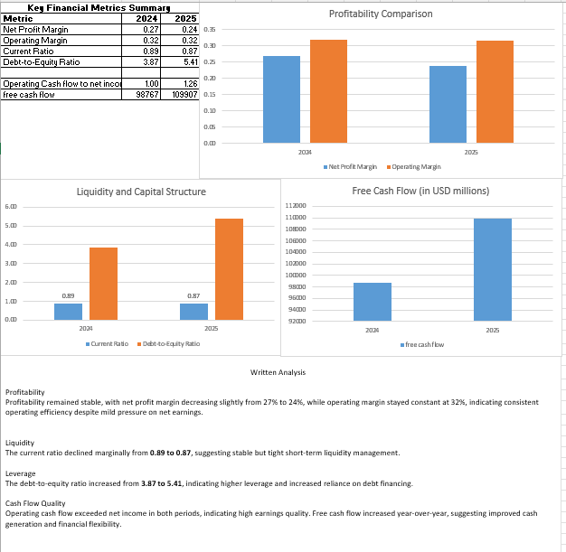
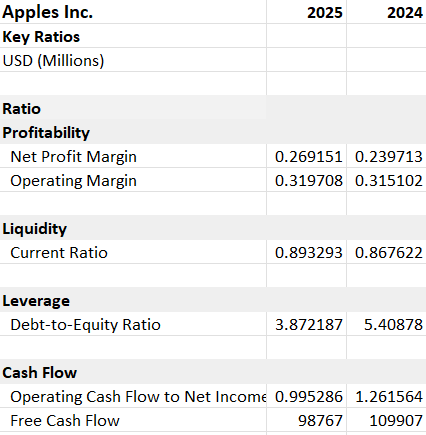
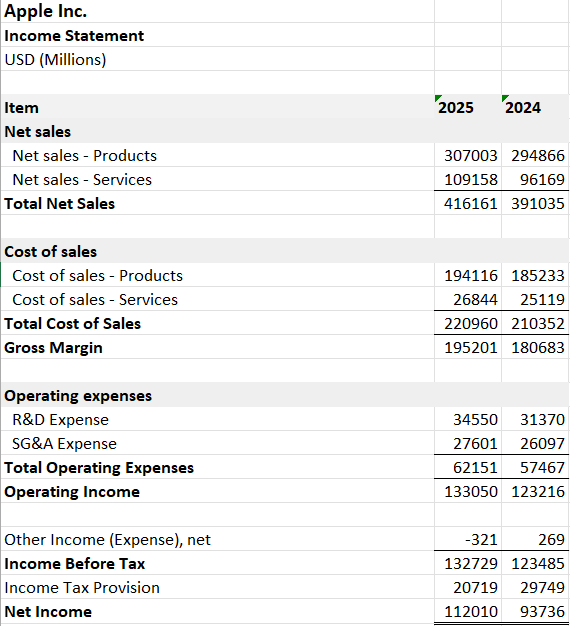
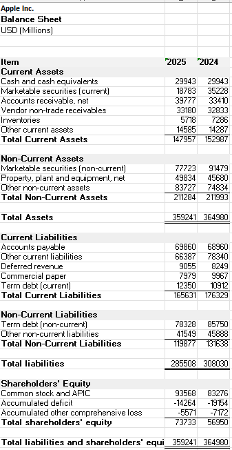
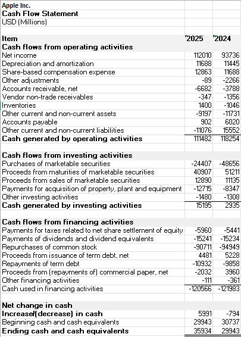

 Financial Statement Analysis & Excel Dashboard

## Overview
This project analyzes **Apple Inc.’s** financial statements to evaluate profitability, liquidity, leverage, and cash flow sustainability.  
The analysis combines structured financial ratio analysis with an Excel dashboard to visualize year-over-year performance trends.

## Key Objectives
- Assess financial health using income statement, balance sheet, and cash flow statement data  
- Evaluate profitability, capital structure, liquidity, and earnings quality  
- Translate financial metrics into clear analytical insights

## Key Metrics Analyzed
- Profitability: Net Profit Margin, Operating Margin  
- Liquidity: Current Ratio  
- Capital Structure: Debt-to-Equity Ratio  
- Cash Flow Quality: Operating Cash Flow to Net Income, Free Cash Flow

## Content Preview
“Dashboard”: 

"Key Ratios":

“Income Statement”: 

“Balance Sheet”:

“Cash Flow Statement”:

